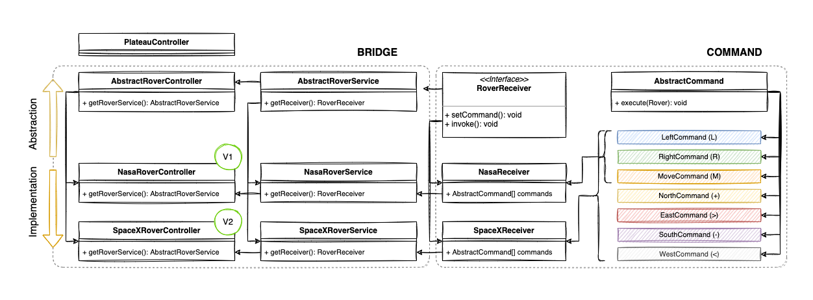

## Giriş

Bu uygulama, orijin noktası(0, 0) sol-alt ve kuzey noktası (y+1) olan, 2 boyutlu bir plato üzerindeki bir mars aracını çeşitli komutlarla yönetebildiğimiz simülasyona ait bir API'dır.

* Bir plato üzerinde birden fazla rover bulunabilir.
* Plato üzerinde bir noktada rover var ise başka bir rover orada deploy edilemez veya hareket edemez. Bir harekete başladıysa hareketi kesilir.
* Uygulama iki versiyona sahiptir: `/api/v1` ve `api/v2`. Uygulamaya çeşitli versiyonlar eklenebilir, kullanılan servisler değişebilir, yeni endpoint'ler eklenebilir veya mevcut endpoint'in yaptığı bir iş genişletilebilir. Uygulamanın birinci versiyonu `L (Sola dön)`, `R (Sağa dön)` ve `M (İleriye doğru hareket et)` komutlarına sahiptir. Komutlardan anlaşılacağı üzere rover, dönüş hareketi yapmadan pozisyon değiştiremez. Bu yüzden ikinci versiyonda bu komutları çalıştıran endpoint geliştirilmiş, kurguya uygun farklı bir nesne kategorizasyonu ile sağlanmıştır. Yeni controller, service vb. nesneler ile sistem genişletilmiştir. Böylece ikinci versiyon ayrıca `+ (Kuzeye hareket et)`, `- (Güneye hareket et)`, `< (Batıya hareket et)` ve `> (Doğuya hareket et)`komutları eklenmiştir.
* Rover, eğer hareket edemez ise `INTERRUPTED` durumunda kalır ve bu duruma gelene kadar uyguladığı komutlardan sonra kalan komutları kuyrukta tutar. Gerekli endpoint ile durma emri verene kadar rover üzerinde başka bir komut çalıştırılamaz.

## Gereksinimler

* [Docker](https://www.docker.com/)

## Kurulum

1. Bu repoyu klonlayın

```bash
$ git clone https://github.com/hakanyolat/mars-rover.git
```

2. `docker-compose` ile ayağa kaldırın

```bash
$ docker-compose up
```

API'ya `http://localhost:9999` adresinden erişebilirsiniz. Tüm endpoint'lere hızlıca göz atmak için repo içerisinde yer alan Postman Collection'ı (Mars Rover.postman_collection.json) inceleyebilirsiniz.

## API Dökümantasyonu

Dökümantasyon'u incelemek için `http://localhost:9999/api/documentation`
adresinde yer alan spesifikasyonlara göz atabilirsiniz.

## Testler

Testleri çalıştırmak için aşağıdaki yönergeyi izleyebilirsiniz.

```bash
$ docker run -it mars-rover_lumen vendor/bin/phpunit
```

## Yapı


